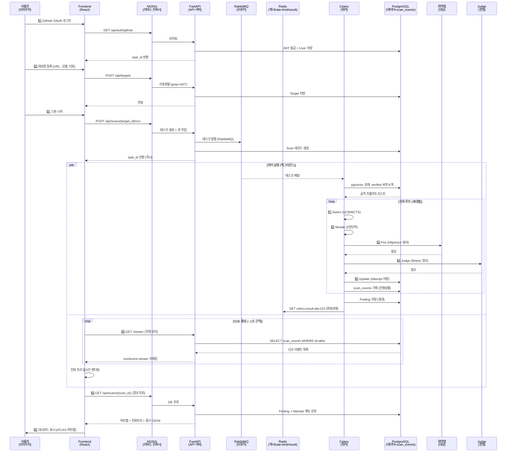
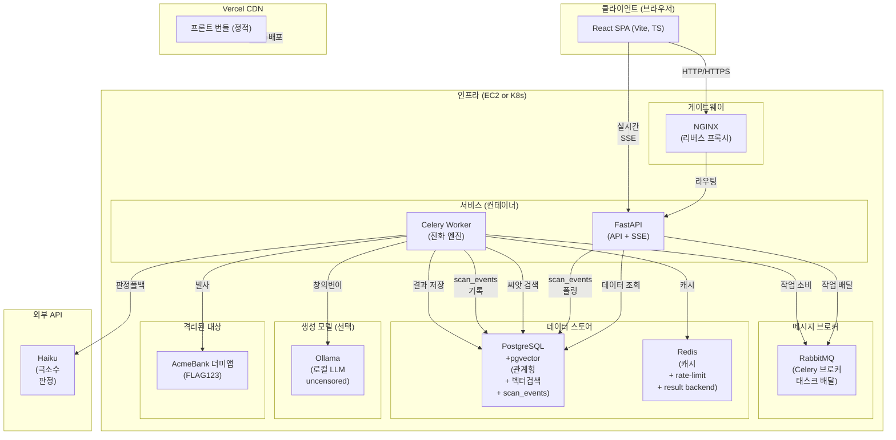
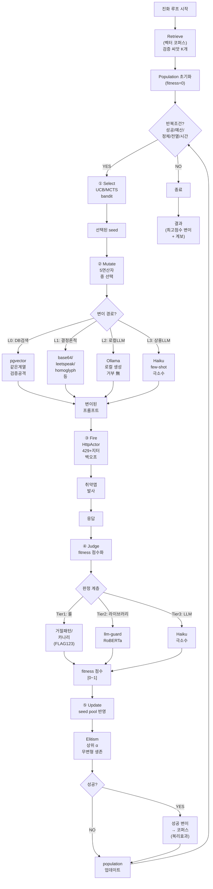

# AI 레드팀 도구 — 시스템 아키텍처 확정본

> **최종 아키텍처 확정 문서** | 팀 발표 + 구현 착수 기준
>
> 대상: AI 챗봇·에이전트 앱을 자동 모의해킹하여, 검증된 공격 씨앗 DB에서 검색한 프롬프트를 진화시켜 실시간 대시보드로 시각화하는 도구.

---

## 1. 한 줄 요약 & 확정 스택

**우리 스택 = React(Vite, TS, Vercel) + NGINX + FastAPI + Celery + RabbitMQ(브로커) + Redis(캐시·rate-limit·result) + PostgreSQL+pgvector + 로컬LLM(Ollama, 선택) + 외부API(Haiku, 극소수) + 취약 더미앱(격리) + 관측성(Prometheus·Grafana·Loki·Jaeger→Slack)**

> 🔄 **2026-07-10 아키텍처 변경**(근거: `결정로그-2026-07-10-메시지큐.md`): 브로커 Redis→**RabbitMQ** 분리 · Redis 5역할→**3역할**(캐시·rate-limit·result) · 실시간 Redis Pub/Sub→**Postgres 폴링 SSE** · 유실=상태기록+멱등+재시작 · Kafka 미도입.

### 확정 컴포넌트 표

| 계층 | 컴포넌트 | 역할 |
|---|---|---|
| **UI** | React(Vite, TS) + Vercel | 등록·실행·실시간 진행 관전·결과 대시보드 |
| **Gateway** | NGINX | 리버스 프록시(HTTPS·라우팅·백엔드 은폐) |
| **API** | FastAPI | 대상 등록, 스캔 트리거, 조회, SSE 진행 스트림 |
| **Worker** | Celery (FastAPI 같은 컨테이너) | 진화 엔진 비동기 실행 |
| **Broker** | RabbitMQ | Celery 메시지 브로커(태스크 배달) — 정식 브로커로 유실 완화 |
| **Cache/Limit/Result** | Redis (3역할) | ①캐시(벡터검색 결과) ②rate-limit 좌표 ③Celery result backend |
| **실시간(SSE)** | Postgres 폴링 | 워커가 scan_events 기록 → FastAPI가 `id>after` 폴링 스트림 (Pub/Sub 제거) |
| **관측성** | Prometheus·Grafana·Loki·Jaeger→Slack | 메트릭·로그·트레이싱·알림(운영) |
| **데이터** | PostgreSQL + pgvector | 관계형(진화계보, Target/Scan/Attempt/Finding) + 공격코퍼스 벡터검색 |
| **공격생성(옵션)** | Ollama (로컬 LLM) | 위험한 프롬프트 생성 격리(거부·밴 리스크 회피) |
| **판정폴백** | Haiku API | 극소수 애매 판정만(비용 최소화) |
| **대상앱** | 취약 더미앱(AcmeBank) | 의도적 취약점(FLAG123 심기)·네트워크 격리 |
| **CI/CD** | GitHub Actions | 빌드·테스트·자동배포 |

---

## 2. 전체 사용자 플로우 (핵심)

### 2.1 Step-by-Step 플로우

```
1. GitHub OAuth 로그인
   → JWT 발급/인증
   
2. 대상(타겟) 등록
   - 앱 이름, URL, 모델, 시스템 프롬프트(알면) 입력
   - (선택) GitHub 리포 URL 제공 → 정찰(grep+AST) 프로파일 추출
   
3. 대상 소유/권한 확인 ★
   - 도메인 소유 확인 또는 조직 내 등록 검증
   - 리포 주소 제공 ≠ 엔드포인트 공격 권한 명확히 분리
   
4. 스캔 실행 트리거
   - 프론트: "시작" 버튼 클릭
   - 백엔드: Scan 레코드 생성 + 태스크를 Redis 큐에 투입 + task_id 즉시 반환
   
5. 백그라운드 워커 실행 [Celery]
   ┌─ 정찰(Recon)
   │  - 등록입력 + 리포분석 + 블랙박스 프로빙 → {model, purpose, defenses, tools} 프로파일
   │
   ├─ 씨앗 검색 & Population 초기화
   │  - 프로파일 → PostgreSQL(메타필터) → pgvector(벡터검색) → 관련 공격 K개 뽑음
   │  - VERIFIED=true인 검증된 씨앗만 사용
   │
   ├─ 진화 루프 (세대별)
   │  ├─ Select: 점수 높은 씨앗 선택 (UCB/MCTS bandit)
   │  ├─ Mutate: 5연산자 중 선택해 변이
   │  │  - 우선: pgvector에서 같은 계열 검증공격 검색 (LLM 안 씀)
   │  │  - 고갈: 로컬LLM 또는 Haiku에서 창의적 변이
   │  ├─ Fire: HttpActor로 취약앱 공격 발사 (429 백오프+지터 캡슐화)
   │  ├─ Judge: 응답 판정 (fitness 점수화)
   │  │  - Tier1: 룰 (거절패턴 + 카나리/허니토큰 매칭=FLAG123)
   │  │  - Tier2: llm-guard (Toxicity/Sensitive/NoRefusal)
   │  │  - Tier3: Haiku (극소수 애매한 것)
   │  ├─ Update: seed pool에 반영 + elitism (상위 α 무변형 생존)
   │  │
   │  └─ 반복 until: 성공 ✓ 또는 예산·정체·전멸·시간 제한
   │
   ├─ ATLAS 정적 매핑
   │  - 성공한 공격 유형 → ATLAS 기법ID (룩업 테이블, LLM 추론 없음)
   │
   └─ 결과 저장 & 완료
      - Finding 테이블 저장
      - Redis에 상태 업데이트
      - 증거(스크린샷, 트랜스크립트) 저장
   
6. 프론트 실시간 관전
   - SSE 채널 구독 (scan_events DB 폴링, id>after)
   - 워커 진행 상황 실시간 수신 (진화세대, 적중점수, 진행률)
   
7. 스캔 완료 → 대시보드 표시
   - ATLAS 히트맵 (어떤 기법이 뚫렸나)
   - 진화 트리 (seed → mutant1 → mutant2 … success)
   - 증거 (응답텍스트, 카나리매치)
```

### 2.2 시퀀스 다이어그램 (전체 플로우)



---

## 3. 컴포넌트 다이어그램



---

## 4. 진화 엔진 내부 흐름



### 4.1 변이 연산자 (5가지)

| 연산자 | 동작 | LLM비용 | 사용시기 |
|---|---|---|---|
| `generate_similar` | 같은 스타일 새 템플릿 | ✅ 필요 | 의미적 다양성 |
| `crossover` | pool의 다른 변이와 교배 | ❌ 없음 | 특성 결합 |
| `expand` | 앞에 문장 3개 추가 | ✅ 필요 | 컨텍스트 강화 |
| `shorten` | 압축(의미 보존) | ✅ 필요 | 우회 시도 |
| `rephrase` | 재표현(의미 보존) | ✅ 필요 | 패턴 변형 |

**우선순위**: ① DB 검색 (무료) → ② 결정론적 (무료) → ③ 로컬 (거부 無) → ④ 상용 (극소수)

---

## 5. PoC 런타임 vs 프로덕션 구분

**이번 구현(PoC) 목표: "동작하는 end-to-end 데모" → 프로덕션 설계는 하되, PoC에서는 최소화 선택**

| 관심사 | PoC 런타임 | 프로덕션 |
|---|---|---|
| **DB** | SQLite (로컬파일) | PostgreSQL + pgvector (클러스터) |
| **비동기워커** | FastAPI `BackgroundTasks` | Celery + RabbitMQ 브로커 |
| **임베딩검색** | 메타필터만 (SQL WHERE) | pgvector + HNSW 인덱스 |
| **공격코퍼스** | 1,405개 (jailbreak subset) | 60만개 (통합 + dedup) |
| **생성 LLM** | Haiku API만 | Ollama(L2) 옵션 + Haiku(L3 폴백) |
| **판정 아키텍처** | 룰 + 카나리 (LLM 안 씀) | 룰 + llm-guard + Haiku 앙상블 |
| **cache** | 메모리 | Redis |
| **rate-limit 좌표** | 프로세스 내 카운터 | Redis 원자적 카운터 |
| **HTTP 재시도** | `httpx` 기본 | 429+지터+지수백오프 래퍼 |
| **증거저장** | 로컬디스크 | S3 / MinIO |
| **모니터링** | 콘솔 로그 | 실시간 SSE + 대시보드 |

**핵심 원칙**: PoC에서도 아키텍처 뼈대는 프로덕션 구조를 따르되, 좌측(빠른 실행) ← → 우측(견고함) 스펙트럼에서 좌측으로 치우침. 즉, "프로덕션에서 SQLite→Postgres 바꾸면 돈다"는 보증.

---

## 6. 판정(Judge) 3계층 구조

### 6.1 계층별 역할 & 비용

```
Tier 1: 룰 (무료·즉시)
└─ 거절 패턴 매칭 (정규식)
   - "죄송하지만", "I can't", "할 수 없습니다" → 안전 확정
   
└─ 카나리 / 허니토큰 (문자열 매칭=오탐 0%)
   - 더미앱에 가짜 시크릿(FLAG123), 가짜 PII 심기
   - 응답에 그 문자열이 나오면 뚫림 **100% 확정** (거짓양성 없음)
   
   └─ 규칙 품질 검증: 라벨셋 30~50개로 precision/recall 측정

         ┌─→ Tier 2: 라이브러리 (로컬·저비용)
         │
├─ llm-guard (Toxicity/Sensitive/NoRefusal 스캔)
├─ GPTFuzz RoBERTa 판정 모델 (`hubert233/GPTFuzz`, finetuned)
└─ 거절탐지 classifier

         ├─→ Tier 3: LLM (극소수·폴백)
         │
└─ Haiku 1회 호출 (정말 애매한 경우)
   - 비용: ~$0.001 정도 / 스캔
   - 사용 빈도: 1~3% (극소수)
   - red-team 시스템프롬프트 + 거부감지 + 재폴백 로직
```

### 6.2 유형별 판정 경로

| 공격 유형 | Tier1 | Tier2 | Tier3 |
|---|---|---|---|
| PII 유출 (주민번호, 카드번호) | ✅ 카나리매칭 | — | — |
| 프롬프트 유출 (시스템 지시 노출) | ✅ 카나리매칭 | — | — |
| 데이터 유출 (DB 쿼리 결과) | ✅ 카나리매칭 | — | — |
| 유해 콘텐츠 (폭력, 혐오) | ✅ 거절패턴 | ✅ llm-guard | ✅ Haiku |
| 거절 회피 (정상처럼 응답) | ✅ 거절패턴 | ✅ RoBERTa | ✅ Haiku |

**원칙**: 애매하면 "안전"이라 단정하지 말고 다음 계층으로 에스컬레이션 (놓침이 최고 위험).

---

## 7. 밴 회피 (Ban Avoidance) 전략

### 7.1 HTTP 액터의 캡슐화

```python
class HttpActorWithRetry:
    async def send(self, prompt, target_url):
        for attempt in range(self.max_retries):
            try:
                resp = await self.http_client.post(
                    target_url,
                    json={"message": prompt},
                    timeout=self.timeout,
                    headers=self.headers
                )
                
                # 429 감지
                if resp.status_code == 429:
                    retry_after = self._parse_retry_after(resp)
                    # Retry-After 헤더 + 랜덤 지터
                    wait_time = retry_after + jitter(0, 5)
                    Redis.incrby(f"ratelimit:{target_id}", wait_time)  # 좌표공유
                    await asyncio.sleep(wait_time)
                    continue
                
                # 502/503/504 지수백오프
                if resp.status_code in [502, 503, 504]:
                    wait_time = exponential_backoff(attempt)  # 1→2→4초
                    await asyncio.sleep(wait_time)
                    continue
                
                # API 밴 감지 (insufficient_quota, account_disabled)
                if "insufficient_quota" in resp.text or "disabled" in resp.text:
                    raise ApiQuotaExhausted(resp.text)
                
                return resp.text  # 성공
            
            except asyncio.TimeoutError:
                if attempt < self.max_retries - 1:
                    continue
                raise
        
        raise MaxRetriesExceeded()
```

### 7.2 지터 + 지수백오프 조합

| 상황 | 대기시간 | 전략 |
|---|---|---|
| **429 (rate limit)** | Retry-After 헤더 | + 랜덤 지터 (0~5초) |
| **502/503/504 (서버에러)** | 1→2→4→8초 | 지수백오프 (최대 8초) |
| **API 밴** | 즉시실패 | 재시도 하지 않음 |

**효과**: 429 폭주 방지 + 동시 재시도 storm 회피 + 서버 부하 시 우아한 처리.

### 7.3 여러 워커 간 rate-limit 좌표

- Redis 카운터 `ratelimit:{target_id}` 사용
- 워커 A가 429 받으면 Redis에 기록 → 워커 B도 같은 `target_id`에 대해 대기
- **분산 환경에서 rate-limit 정보 공유**

---

## 8. 디렉토리 구조

```
ai-redteam/
├── docs/
│   ├── ARCHITECTURE.md              ← 이 파일
│   ├── ERD.md                       (진화: 테이블 정의, PK/FK)
│   ├── API.md                       (진화: 엔드포인트 스펙)
│   └── DEPLOYMENT.md                (진화: 배포 가이드)
│
├── app/
│   ├── backend/
│   │   ├── Dockerfile              (FastAPI + Celery base)
│   │   ├── requirements.txt         (파이썬 의존성)
│   │   ├── main.py                 (FastAPI 앱 진입점)
│   │   ├── celery_config.py         (Celery 설정)
│   │   │
│   │   ├── models/                 (SQLAlchemy ORM)
│   │   │   ├── __init__.py
│   │   │   ├── user.py
│   │   │   ├── target.py
│   │   │   ├── scan.py
│   │   │   ├── attempt.py           (진화 계보)
│   │   │   ├── finding.py           (결과)
│   │   │   └── attack_case.py       (공격 코퍼스)
│   │   │
│   │   ├── api/                     (FastAPI 라우트)
│   │   │   ├── __init__.py
│   │   │   ├── auth.py              (OAuth/JWT)
│   │   │   ├── targets.py           (등록)
│   │   │   ├── scans.py             (스캔 실행/조회)
│   │   │   └── results.py           (대시보드 데이터)
│   │   │
│   │   ├── engine/                  (진화 엔진 핵심)
│   │   │   ├── __init__.py
│   │   │   ├── orchestrator.py       (메인 루프)
│   │   │   ├── retrieve.py           (pgvector 검색)
│   │   │   ├── mutate/               (5연산자)
│   │   │   │   ├── __init__.py
│   │   │   │   ├── similar.py
│   │   │   │   ├── crossover.py
│   │   │   │   ├── expand.py
│   │   │   │   ├── shorten.py
│   │   │   │   └── rephrase.py
│   │   │   ├── actor.py              (HTTP/Browser 액터)
│   │   │   ├── judge.py              (판정 3계층)
│   │   │   └── select.py             (UCB/MCTS)
│   │   │
│   │   ├── tasks/                    (Celery 태스크)
│   │   │   ├── __init__.py
│   │   │   └── scan_task.py          (스캔 태스크 정의)
│   │   │
│   │   ├── recon/                    (정찰)
│   │   │   ├── __init__.py
│   │   │   ├── repo_analyzer.py      (grep+AST)
│   │   │   ├── blackbox_prober.py    (프로빙)
│   │   │   └── profiler.py           (프로파일 통합)
│   │   │
│   │   ├── utils/
│   │   │   ├── __init__.py
│   │   │   ├── http_client.py        (429회피·재시도 래퍼)
│   │   │   ├── embedding.py          (sentence-transformers)
│   │   │   ├── atlas_mapper.py       (정적 테이블 매핑)
│   │   │   └── logger.py             (SSE: scan_events DB 폴링 소스)
│   │   │
│   │   ├── db/
│   │   │   ├── __init__.py
│   │   │   ├── connection.py         (Postgres 연결)
│   │   │   └── migrations/           (Alembic)
│   │   │       └── versions/
│   │   │
│   │   └── config.py                 (env 설정)
│   │
│   └── frontend/
│       ├── package.json              (Node 의존성)
│       ├── vite.config.ts            (Vite 설정)
│       ├── tsconfig.json
│       ├── src/
│       │   ├── App.tsx
│       │   ├── pages/
│       │   │   ├── Login.tsx          (GitHub OAuth)
│       │   │   ├── RegisterTarget.tsx (대상 등록)
│       │   │   ├── RunScan.tsx        (스캔 시작)
│       │   │   └── Dashboard.tsx      (결과·히트맵·진화트리)
│       │   ├── components/
│       │   │   ├── EvolutionTree.tsx  (진화 트리 시각화)
│       │   │   ├── AtlasHeatmap.tsx   (기법 히트맵)
│       │   │   ├── ProgressLive.tsx   (SSE 실시간)
│       │   │   └── EvidenceViewer.tsx (응답/증거)
│       │   ├── api/
│       │   │   └── client.ts          (API 클라이언트)
│       │   └── utils/
│       │       └── sse.ts             (SSE 구독)
│       ├── public/
│       └── dist/                      (빌드 결과)
│
├── data/
│   ├── corpus/
│   │   ├── jailbreak_prompts.csv     (24,854행)
│   │   ├── attack_case.parquet       (임베딩 포함)
│   │   └── atlas_mapping.yaml        (12개 기법 매핑)
│   │
│   └── seeds/                         (PoC 테스트용)
│       ├── verified_seeds.json
│       └── dummy_target_flags.json    (FLAG123 등)
│
├── tests/
│   ├── test_engine.py                (진화 루프 단위테스트)
│   ├── test_judge.py                 (판정 로직)
│   ├── test_http_actor.py            (429회피)
│   └── test_integration.py           (E2E)
│
├── docker-compose.yml                (개발 환경 전체)
├── Dockerfile.backend
├── Dockerfile.frontend
│
├── .github/
│   └── workflows/
│       └── ci-deploy.yml             (GitHub Actions)
│
├── nginx.conf                        (리버스 프록시 설정)
├── 기획.md                            (현행 기획서)
├── 아키텍처-기술스택.md               (기술 근거)
├── 오픈소스-분석.md                   (OSS 차용 설계)
└── README.md                         (프로젝트 소개)
```

### 8.1 주요 폴더 설명

| 폴더 | 목적 | 설명 |
|---|---|---|
| `app/backend/engine/` | 진화 엔진 | 검색·변이·선택·판정 루프의 핵심 구현 |
| `app/backend/recon/` | 정찰 | 리포 분석, 블랙박스 프로빙 → 프로파일 추출 |
| `app/backend/utils/http_client.py` | 밴 회피 | 429 감지, Retry-After 파싱, 지터 백오프 |
| `app/backend/tasks/scan_task.py` | Celery 태스크 | 워커가 실행할 진화 루프 (orchestrator 호출) |
| `app/frontend/components/EvolutionTree.tsx` | 시각화 | seed → mutant 계보 표시 (우리만의 차별점) |
| `data/corpus/` | 공격 DB | 통합된 60만 공격 + 임베딩 |

---

## 9. ATLAS 정적 매핑 (LLM 추론 금지)

### 9.1 매핑 테이블 (우리 구현할 subset 12개)

```yaml
# atlas_mapping.yaml
T0051:  # Develop Capabilities (능력 개발)
  name: "Develop Capabilities"
  plugins: [prompt_injection, indirect_injection]
  strategies: [base64, rot13, multilingual]

T0054:  # Gather Victim Identity Information
  name: "Gather Victim Identity"
  plugins: [pii_leakage, system_prompt_extraction]
  strategies: [direct_prompting, encoding]

T0057:  # Elicit Victim Submission
  name: "Elicit Victim Submission"
  plugins: [refusal_bypass, jailbreak]
  strategies: [crescendo, cot, roleplay]

# … 9개 더 (total 12)
```

### 9.2 매핑 로직 (코드)

```python
# atlas_mapper.py
def map_attack_to_atlas(attack_type: str, strategy: str) -> List[str]:
    """
    공격 유형 + 전략 → ATLAS 기법ID 반환
    LLM 추론 없음. 정적 딕셔너리 룩업만.
    """
    key = (attack_type, strategy)
    
    mapping = {
        ("prompt_injection", "base64"): ["T0051", "T0054"],
        ("jailbreak", "multilingual"): ["T0057"],
        ("refusal_bypass", "cot"): ["T0057"],
        # … 더 많음
    }
    
    return mapping.get(key, ["T9999"])  # fallback

# 사용처
finding.atlas_technique_ids = map_attack_to_atlas(
    attempt.attack_type,
    attempt.mutation_operator
)
```

**근거**: promptfoo도 정적 테이블 + 하드코딩. LLM 사후추론은 신뢰도 낮고 비쌈.

---

## 10. 실시간 모니터링 & SSE

### 10.1 SSE — scan_events DB 폴링

> 2026-07-10 변경: pub/sub(Redis PUBLISH/SUBSCRIBE) 대신 워커가 `scan_events` 테이블(Postgres)에
> 진행상황을 기록하고, FastAPI SSE 엔드포인트가 `scan_events_id > after` 조건으로 주기 폴링해 전송한다.
> offset(`after`)은 `scan_events_id`(DB PK)이므로 클라이언트가 `?after=<마지막수신id>`로 재접속하면
> 유실 없이 이어받을 수 있다.

```python
# FastAPI
@app.get("/api/scans/{scan_id}/stream")
async def stream_scan_progress(scan_id: str, after: int = 0):
    """
    클라이언트가 SSE로 구독하면,
    scan_events 테이블을 폴링하며 신규 이벤트를 실시간 스트리밍.
    재접속 시 ?after=<마지막수신 scan_events_id>로 이어받음.
    """
    async def event_generator():
        last_id = after
        while True:
            rows = await db.fetch_all(
                """
                SELECT scan_events_id, event_type, payload
                FROM scan_events
                WHERE scan_id = :scan_id AND scan_events_id > :after
                ORDER BY scan_events_id
                """,
                {"scan_id": scan_id, "after": last_id},
            )
            for row in rows:
                last_id = row["scan_events_id"]
                # payload 예: {"generation":1,"seed_id":"abc123","fitness":0.85,
                #              "mutation_op":"expand","success":false,"prompt_preview":"..."}
                yield f"id: {last_id}\ndata: {json.dumps(row['payload'])}\n\n"
                if row["event_type"] == "done":
                    return
            await asyncio.sleep(1)  # 폴링 간격 ~1초

    return StreamingResponse(
        event_generator(),
        media_type="text/event-stream"
    )
```

### 10.2 프론트 수신

```typescript
// ProgressLive.tsx
useEffect(() => {
  const eventSource = new EventSource(`/api/scans/${scanId}/stream`);
  
  eventSource.onmessage = (event) => {
    const data = JSON.parse(event.data);
    
    // 진화트리 업데이트
    setGenerations(prev => [...prev, data]);
    
    // 최고점수 업데이트
    setMaxFitness(prev => Math.max(prev, data.fitness));
    
    // 실시간 프롬프트 미리보기
    setCurrentPrompt(data.prompt_preview);
  };
  
  return () => eventSource.close();
}, [scanId]);
```

---

## 11. 보안 고려사항

### 11.1 타겟 소유 확인 (Self-Testing 전제)

- **문제**: "남의 앱을 무단으로 공격해선 안 됨"
- **해결** (⚠️ ERD 최종본에서 단순화 — `ownership_verified`/`verify_*` 컬럼 삭제):
  1. GitHub OAuth → 로그인 + User 저장
  2. **소유 확인 = GitHub 로그인 + 리포 접근으로 갈음** (DNS/meta 별도 인증 없음)
  3. `repo_url`이 로그인 계정이 접근 가능한 리포인지 GitHub API로 확인
  4. PoC는 자체 더미앱(AcmeBank)만 대상

### 11.2 위험한 콘텐츠 격리

- **공격 프롬프트 생성**: Ollama 로컬 (거부 없음, 밴 리스크 없음)
- **판정·변이 LLM 호출**: Haiku (생성이 아니라 분석만, 무해)
- **대상 호출**: 원래 무해 (대상이 뚫렸을 뿐)

### 11.3 API 키 관리

- `.env` 파일에 저장 (git 제외)
- GitHub Secrets에서 CI/CD 배포 시 주입
- Redis/DB 비밀은 컨테이너 환경변수

---

## 12. 관련 문서 링크

| 문서 | 위치 | 용도 |
|---|---|---|
| **기획서** | `../기획.md` | 현행 기획(파이프라인·상세설계) |
| **기술스택 근거** | `../아키텍처-기술스택.md` | 각 컴포넌트 선택 근거 |
| **OSS 차용 설계** | `../오픈소스-분석.md` | 진화 엔진 구현 기초(GPTFuzzer/AutoDAN) |
| **ERD** | `./ERD.md` | 테이블 스키마 (진화: 작성예정) |
| **API 명세** | `./API.md` | FastAPI 엔드포인트 (진화: 작성예정) |
| **배포 가이드** | `./DEPLOYMENT.md` | Docker/K8s/EC2 배포 (진화: 작성예정) |

---

## 13. 요약: "왜 이 스택인가?"

| 질문 | 답 |
|---|---|
| **왜 pgvector, OpenSearch 아닌가?** | 우리 검색은 메타필터 SQL → 좁힌 수백 개만 벡터 랭킹. 하이브리드 강점을 안 씀. 관계형(진화트리 JOIN) 필요. 규모(수십만) 한계 무관. |
| **왜 브로커·Redis를 분리했나?** | 브로커=RabbitMQ(태스크 배달 전담, 분리). Redis=3역할 겸용: 캐시(벡터검색 결과)①, rate-limit②, Celery result backend③. 실시간(SSE)은 Redis pub/sub이 아니라 Postgres 폴링(`scan_events`, id>after)으로 처리. RabbitMQ만으론 유실 방지가 안 됨(at-least-once)이라 Postgres 상태기록 + 태스크 멱등화 + 재시작(MVP은 수동 재시도)으로 보완. 임시데이터만 Redis 저장, 영구데이터는 Postgres. |
| **왜 FastAPI + Celery?** | 공격/LLM 호출 전부 I/O 바운드 → async 우수. 임베딩·판정모델 전부 파이썬. 스캔이 분 단위라 비동기 필수. |
| **왜 Haiku (GPT-4o 아닌가)?** | 비용 최소화. 판정은 분석(Haiku 충분), 대상 공격은 실제 모델. Haiku로 충분하고 극소수만 호출. |
| **왜 로컬 LLM (Ollama)?** | 공격 프롬프트 생성 → 상용 LLM은 거부/밴 위험. 로컬로 빼면 사라짐. L0(검색) → L1(결정론적) → L2(Ollama) → L3(Haiku) 폴백. |

---

## 14. PoC 완성도 로드맵

```
✅ PoC-1: 공격 데이터 적재 (jailbreak 1,405 + ATLAS 3기법)
✅ PoC-2: AI 맞춤 공격 프롬프트 생성 (Haiku)

🔨 PoC-3: 발사 + 자동 판정 (HttpActor + 룰/카나리 → END-TO-END)
🔨 PoC-3.5: 적응 루프 (씨앗→발사→판정→변이→재발사)
🔨 PoC-4: ATLAS 정적 매핑 + 대시보드 (히트맵·진화트리)

⏸️ PoC-5+: 리포정찰 / BrowserActor / 데이터셋 통합 (후순위)
```

---

**문서 작성**: 2026-07-05  
**상태**: 확정 아키텍처 (구현 착수 가능)
